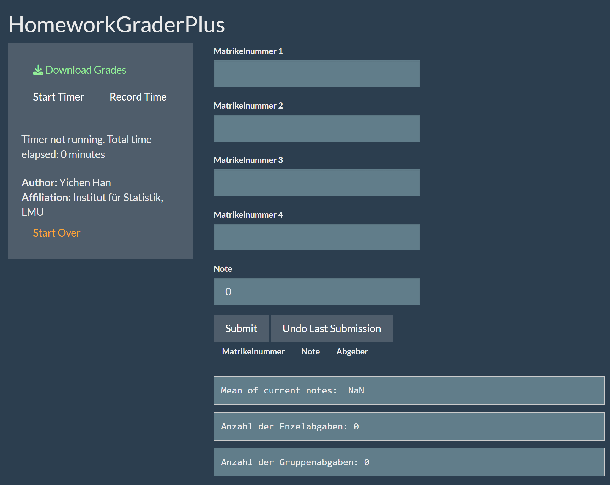

# HomeworkGraderPlus
Efficiently manage and analyze homework grading for university TAs. Features group submissions, automatic primary submitter identification, submission counts, grade caching, Excel export, and working time tracking for correction. Enhances grading workflow with data-driven insights.

## Features
**1. Group Submission Support**: Accommodates up to 4 students per group submission, recording their scores and automatically identifying the first student's ID as the primary submitter.

**2. Submission Type Tracking**: Automatically distinguishes between individual and group submissions, providing quick insights into submission patterns and average grades.

**3. Persistent Grade Storage**: Grades are saved locally in a CSV or RDS file, ensuring data is retained even if the application is restarted, facilitating a seamless grading experience.

**4. Excel Export**: Enables the easy export of grades into a Microsoft Excel sheet, allowing for further analysis or record-keeping outside the app.

**5. Time Tracking for Grading**: Introduces the ability to track and cache the time spent on grading tasks, helping educators manage their workload more effectively.

## Layout

